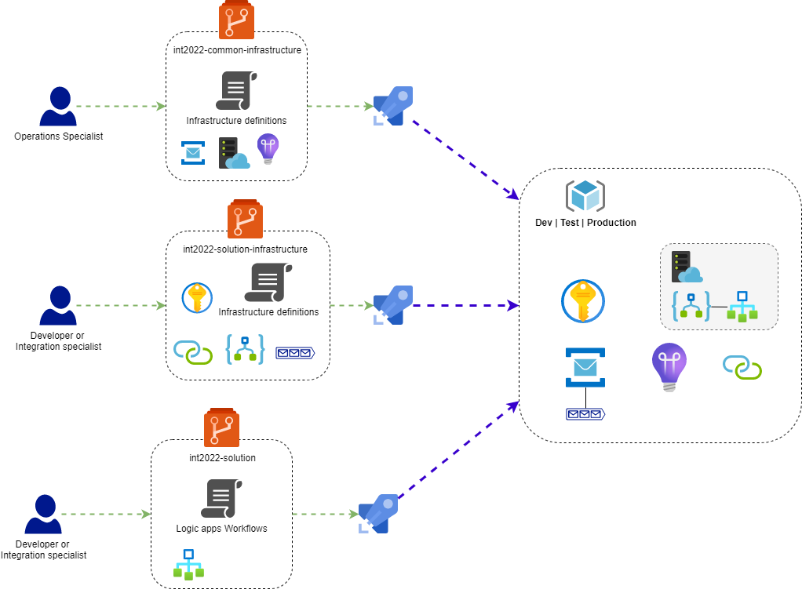

The material consists of 3 repositories to represent different infrastructural roles.

| Repository                     | Comment                                                                                                                            |
| :----------------------------- | :--------------------------------------------------------------------------------------------------------------------------------- |
| int2022-solution               | This repository that contains all artifacts that are part of the Logic App itself.                                                 |
| in2022-solution-infrastructure | Repository with IaC code for resources that belong to the solution but not code, e.g. Service Bus Queues, Consumption connections. |
| in2022-common-infrastructure   | Repository with IaC code for resources that are common to many solutions, like AppService Plan, Service Bus Namespace.             |

