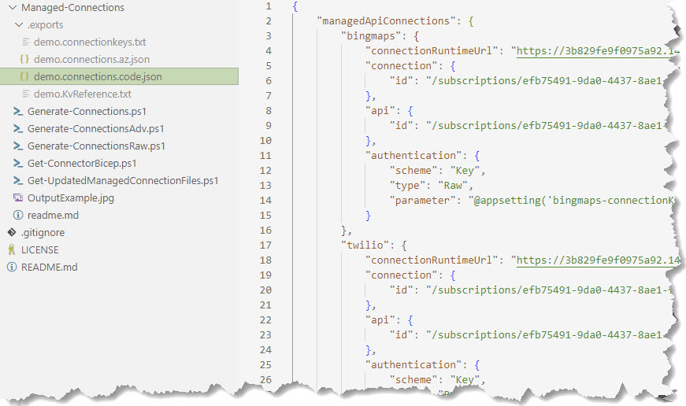

**Get-ConnectorBicep.ps1** 

Will generate a bicep files under _.exports_ folder named after the chosen connector. 

> **Note** The output folder **.exports** is added to _.gitignore_.

Known issues:

- Object parameters are not handled correctly
- Non-string parameters are sometimes expected as strings in the parameterValues section.

**Get-UpdatedManagedConnectionFiles.ps1**

Will generate connections.json files based on the connections in a provided resource group.

>Assumes you have generated the connections with **Get-ConnectorBicep.ps1** and have stored the connectionkey in KeyVault. 

Calls **Generate-ConnectionsRaw.ps1** and **Generate-Connections.ps1** and saves the files in a folder you provide. The txt file contains connectionKeys from Keyvault, *.code.json contains the information to use in Visual Studio Code and *.az.json as the information should look like for Azure in the provided resource group.

**Generate-ConnectionsAdv.ps1**

Used in the Azure DevOps pipeline to generate a connections.json to use when deploying. Calls **Generate-Connections.ps1**. The keys can be copied to your local.settings.json.
If the key have expired do a new release with the bicep files and the keys will be updated in KeyVault.

>**Note** The script **Generate-Connections.ps1** is a copy from here https://github.com/Azure/logicapps/blob/master/azure-devops-sample/.pipelines/scripts/Generate-Connections.ps1

